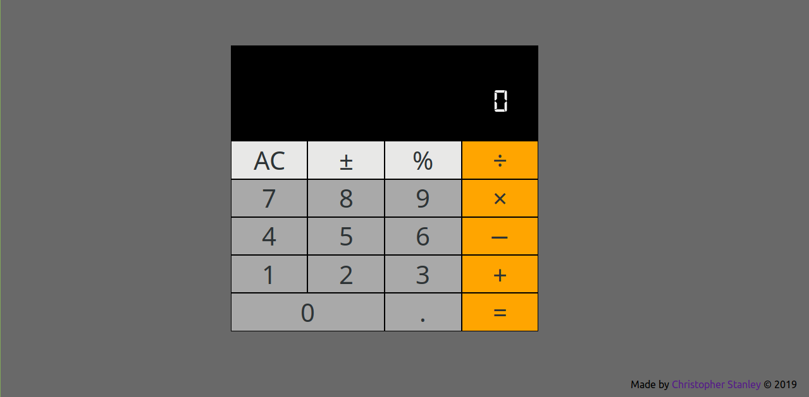
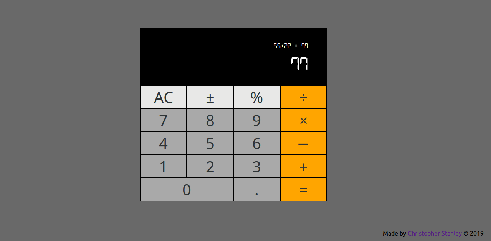

<h1 align="center">JavaScript Calculator</h1>

A responsive calculator web app built with React.js (create-react-app)

## Table of Contents
* [Project Status](#project-status)
* [Features](#features)
* [Screenshots](#screenshots)
* [Technologies](#technologies)
* [Inspirations](#inspirations)
* [Contact](#contact)
* [License](#license)

## Project Status
This project is currently: _In Progress_

## Features
Complete:
- [X] Perform basic mathematical operations such as addition, subtraction, multiplication, division
- [X] Clear the calculator's input using the 'AC' button

To-Do:
- [ ] Implement the percent operator to turn whole numbers to decimals
- [ ] Implement the sign operator to change numbers from positive to negative and vice versa
- [ ] Persist recent calculations in localStorage
- [ ] Display calculations from localStorage in a 'History' display area
- [ ] Implement a 'C' button to clear only the calculator's input
- [ ] Refactor the 'AC' button to clear the calculator's input and history (localStorage)

User Stories Fulfilled:

- [X] User Story #1: My calculator should contain a clickable element containing an = (equal sign) with a corresponding id="equals"
- [X] User Story #2: My calculator should contain 10 clickable elements containing one number each from 0-9, with the following corresponding IDs: id="zero", id="one", id="two", id="three", id="four", id="five", id="six", id="seven", id="eight", and id="nine"
- [X] User Story #3: My calculator should contain 4 clickable elements each containing one of the 4 primary mathematical operators with the following corresponding IDs: id="add", id="subtract", id="multiply", id="divide"
- [X] User Story #4: My calculator should contain a clickable element containing a . (decimal point) symbol with a corresponding id="decimal"
- [X] User Story #5: My calculator should contain a clickable element with an id="clear"
- [X] User Story #6: My calculator should contain an element to display values with a corresponding id="display"
- [X] User Story #7: At any time, pressing the clear button clears the input and output values, and returns the calculator to its initialized state; 0 should be shown in the element with the id of display
- [X] User Story #8: As I input numbers, I should be able to see my input in the element with the id of display
- [X] User Story #9: In any order, I should be able to add, subtract, multiply and divide a chain of numbers of any length, and when I hit =, the correct result should be shown in the element with the id of display
- [X] User Story #10: When inputting numbers, my calculator should not allow a number to begin with multiple zeros
- [X] User Story #11: When the decimal element is clicked, a . should append to the currently displayed value; two . in one number should not be accepted
- [X] User Story #12: I should be able to perform any operation (+, -, *, /) on numbers containing decimal points
- [X] User Story #13: If 2 or more operators are entered consecutively, the operation performed should be the last operator entered
- [X] User Story #14: Pressing an operator immediately following = should start a new calculation that operates on the result of the previous evaluation
- [X] User Story #15: My calculator should have several decimal places of precision when it comes to rounding (note that there is no exact standard, but you should be able to handle calculations like 2 / 7 with reasonable precision to at least 4 decimal places)

## Screenshots

## Technologies
Built with:
* React.js (Create-React-App)
* CSS

## Inspirations
This project was built as part of freeCodeCamp's [Front End Libraries Certification](https://learn.freecodecamp.org/front-end-libraries/front-end-libraries-projects/build-a-javascript-calculator).

## Contact
Twitter - [@CBStanley12](https://twitter.com/CBStanley12)

DEV - [cbstanley12](https://dev.to/cbstanley12)

## License
**MIT License**: 
A short and simple permissive license with conditions only requiring preservation of copyright and license notices. Licensed works, modifications, and larger works may be distributed under different terms and without source code.
